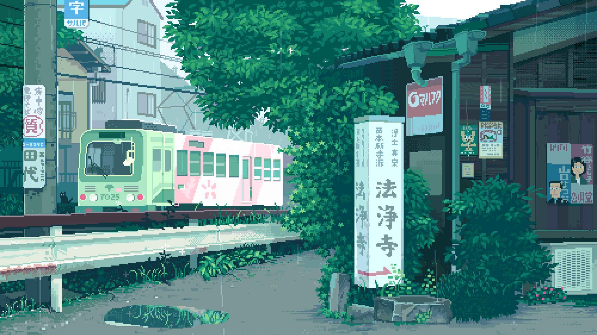

<!-- Gradient Banner -->

  

<table border="2px" width="100%">
  <tr>
    <!-- Left: Bio -->
    <td width="60%" valign="top">

## 🚀 About Me

I'm currently a **NLP Researcher** at **VinNLP and **PhD Student in Computer Science** – VinUniversity**  
with hands-on experience in building AI/NLP products and ML pipelines.

### 💼 Experience
- 🧠 AI Engineer at **TECHVIFY** – R&D Department (10 months)  
- 📱 AI Engineer at **SAMSUNG** – R&D Department (7 months)  
- 🧪 Research Assistant in **Computer Vision** at **ISPAL Lab** (2 years)  
- 🎓 Bachelor's in **Control Engineering & Automation**,  
  *Hanoi University of Science and Technology*

### 📫 Contact
- ✉️ Email: nguyenhuyhung192002@gmail.com  
- 💼 [LinkedIn – @Huyt](https://www.linkedin.com/in/h%C3%B9ng-nguy%E1%BB%85n-huy-8888521b9/)

> ⚡ *Fun fact: I always give my best in everything I do.*

</td>

<!-- Right: GitHub Stats -->
<td width="40%" align="center" valign="top">

  
   
  

</td>
  </tr>
</table>

  

